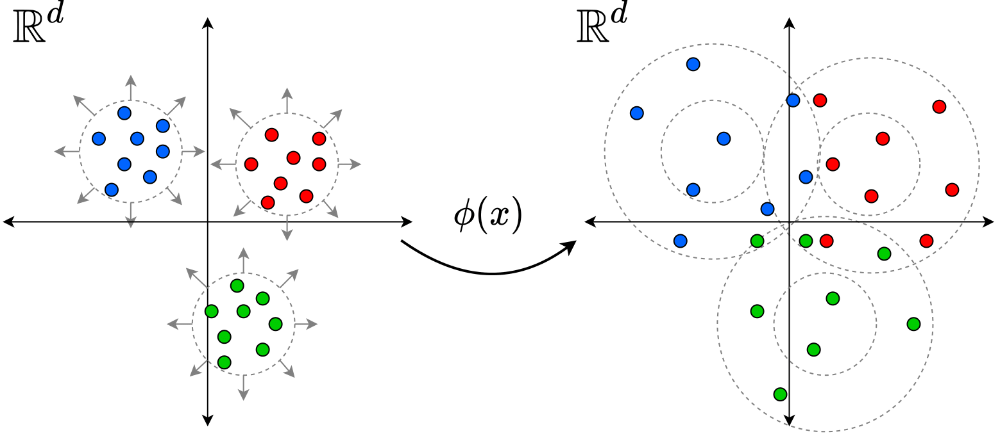

# Fairness Aware Rate Maximization (FaRM)

This repository contains the implementation of the TACL 2022 paper titled:

> ["Learning Fair Representations via Rate Distortion Maximization"](https://arxiv.org/pdf/2202.00035.pdf),<br/>
> [Somnath Basu Roy Chowdhury](https://www.cs.unc.edu/~somnath/) and [Snigdha Chaturvedi](https://sites.google.com/site/snigdhac/).



## Rate-Distortion

The implementation of the rate-distortion loss function in unconstrained and constrained setup is present in `src/utils/loss.py`. We present 3 variations of the loss: `RateDistortionUnconstrained`, `RateDistortionConstrained` and `RateDistortionConstrainedMultiple`. Each of the above modules can be treated as a loss criterion function. The function takes as the features $X \in \mathbb{R}^{n \times d}$ and protected attribute labels $g \in \mathbb{R}^{n}$.


## Experiments

We present the experiments using FaRM in the following setups:

1. Unconstrained debiasing - GloVe embeddings, BIOS, DIAL
2. Constrained debiasing - DIAL, PAN16, BIOS (single protected variable)
3. Constrained debiasing - PAN16 (multiple protected variable)

### Data
The data for the experiments can be found in the following resources: [https://github.com/shauli-ravfogel/nullspace_projection](https://github.com/shauli-ravfogel/nullspace_projection) and [https://github.com/brcsomnath/adversarial-scrubber](https://github.com/brcsomnath/adversarial-scrubber)


### Unconstrained Debiasing
### Word embedding debiasing (Section 6.1)

```
python src/unconstrained/glove-embeddings.py \
        --epochs 100 \
        --num_layers 4
```

### Biography classification (Section 6.2)

For BERT embeddings:
```
python src/unconstrained/biasbios-BERT.py \
        --epochs 15 \
        --num_layers 4
```

For FastText embeddings:
```
python src/unconstrained/biasbios-fasttext.py \
        --epochs 15 \
        --num_layers 4
```

### Controlled Sentiment Classifcation (Section 6.3)

For different proportions of the protected attribute change the ratio=[0.5, 0.6, 0.7, 0.8]
```
python src/unconstrained/deepmoji.py \
        --epochs 100 \
        --num_layers 7
```

### Constrained Debiasing (single protected attribute)
To run the experiments in Section 7.1 for the constrained debiasing execute:

```
python src/constrained/constrained-single.py \
        --dataset <dataset_name> \
        --epochs 25
```

The dataset name can be selected from below:
```
dial: DIAL (y: Sentiment, g: Race)
pan16: PAN16 (y: Mention, g: Gender)
dial-mention: DIAL (y: Mention, g: Race)
pan16-age: PAN16 (y: Mention, g: Age)
```

### Constrained Debiasing (multiple protected attribute)
To run the experiments in Section 7.2 for the constrained debiasing execute:

```
python src/constrained/constrained-multiple.py \
        --dataset pan16-dual \
        --epochs 25
```

## Reference

```bibtex

@article{chowdhury2022learning,
  title         = {Learning Fair Representations via Rate-Distortion Maximization},
  author        = {Basu Roy Chowdhury, Somnath and Chaturvedi, Snigdha},
  year          = {2022},
  journal = {Transactions of the Association for Computational Linguistics},
  url = {https://arxiv.org/pdf/2202.00035.pdf},
  eprint        = {2202.00035}
}
```